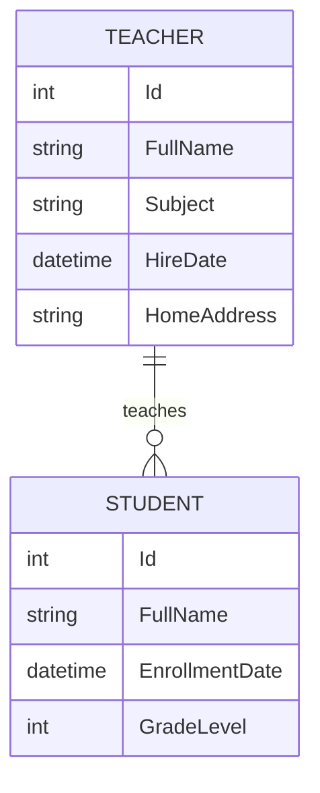

# Domain Model: School Management System

## 1. Overview

This document defines the **domain model** for a simple School Management System.  
It describes the main entities, their properties, and relationships that govern interactions between students and teachers.

The model focuses on representing basic school operations such as **student enrollment**, **teacher assignments**, and **subject management**.  
While minimal, this model provides a foundation for extending the system with additional features such as courses, schedules, and evaluations.

---

## 2. Entities

### 2.1 Student

Represents a learner enrolled in the school.

#### Class Definition
```csharp
public class Student
{
    public int Id { get; set; }
    public string FullName { get; set; } = string.Empty;
    public DateTime EnrollmentDate { get; set; }
    public int GradeLevel { get; set; }
}
```

#### Property Details

| Property | Type | Description |
|-----------|------|-------------|
| **Id** | `int` | Unique identifier for the student. |
| **FullName** | `string` | Full name of the student (e.g., "Amir Hadžić"). |
| **EnrollmentDate** | `DateTime` | Date when the student enrolled in the school. |
| **GradeLevel** | `int` | Numeric grade level or academic year (e.g., 9 = first year of high school). |

#### Example JSON
```json
{
  "Id": 101,
  "FullName": "Amir Hadžić",
  "EnrollmentDate": "2023-09-01T00:00:00",
  "GradeLevel": 10
}
```

---

### 2.2 Teacher

Represents an instructor or educator responsible for teaching one or more students.

#### Class Definition
```csharp
public class Teacher
{
    public int Id { get; set; }
    public string FullName { get; set; } = string.Empty;
    public string Subject { get; set; } = string.Empty;
    public DateTime HireDate { get; set; }
    public string HomeAddress { get; set; } = string.Empty;
}
```

#### Property Details

| Property | Type | Description |
|-----------|------|-------------|
| **Id** | `int` | Unique identifier for the teacher. |
| **FullName** | `string` | Full name of the teacher (e.g., "Lejla Kovačević"). |
| **Subject** | `string` | Subject or specialization taught (e.g., "Mathematics"). |
| **HireDate** | `DateTime` | Date when the teacher was officially hired. |
| **HomeAddress** | `string` | Teacher residential address. Stored as plain string. Consider privacy/data-protection implications before capturing or displaying. |

#### Example JSON
```json
{
  "Id": 11,
  "FullName": "Lejla Kovačević",
  "Subject": "Mathematics",
  "HireDate": "2021-08-15T00:00:00",
  "HomeAddress": ""
}
```

---

## 3. Relationships

- A **Teacher** can teach multiple **Students**.  
- A **Student** can be taught by multiple **Teachers**, depending on enrolled subjects.  
- This creates a **many-to-many** relationship that can be represented via a linking table such as `TeacherStudent` or a `Course` entity.

#### Example Conceptual Relationship



---

## 4. Design Considerations

- **Extensibility:**  
  This model is designed to be easily extended with new entities such as `Course`, `Classroom`, `Exam`, or `Attendance`.

- **Normalization:**  
  The current entities are normalized (each entity represents one logical concept).  
  Future enhancements (e.g., `Address`, `Parent`, or `Schedule`) can be linked through foreign keys.

- **Persistence:**  
  When implemented with Entity Framework Core, each entity can be mapped to a separate database table.  
  A join entity or navigation property can be used to represent the `many-to-many` relationship.

#### Example Future Extension (Entity Framework style)

```csharp
public class TeacherStudent
{
    public int TeacherId { get; set; }
    public Teacher Teacher { get; set; }

    public int StudentId { get; set; }
    public Student Student { get; set; }
}
```

---

## 5. Domain Rules and Constraints

| Rule | Description |
|------|--------------|
| **R1** | A `Student` must have a valid `EnrollmentDate` that cannot be in the future. |
| **R2** | A `Teacher` must have a valid `HireDate` before they can be assigned to students. |
| **R3** | `GradeLevel` values should be restricted to the institution's defined range (e.g., 1–12). |
| **R4** | Each `Teacher` must have at least one `Subject` defined. |

---

## 6. Future Enhancements

Potential areas for system growth include:

- Adding `Course` and `Subject` entities for better curriculum management.  
- Introducing `Classroom` or `Schedule` for time and space organization.  
- Tracking `Exam` and `Grade` entities to record student performance.  
- Integrating authentication for teachers and students through a `User` entity.  
- Adding soft deletes or audit trails to track historical changes.

---

## 7. Summary

This domain model establishes a minimal yet scalable structure for managing relationships between students and teachers.  
It can serve as a starting point for school management systems, learning platforms, or educational analytics dashboards.

By following standard design principles and C# conventions, this model remains:
- Simple to understand  
- Easy to extend  
- Ready for persistence in relational databases or APIs
